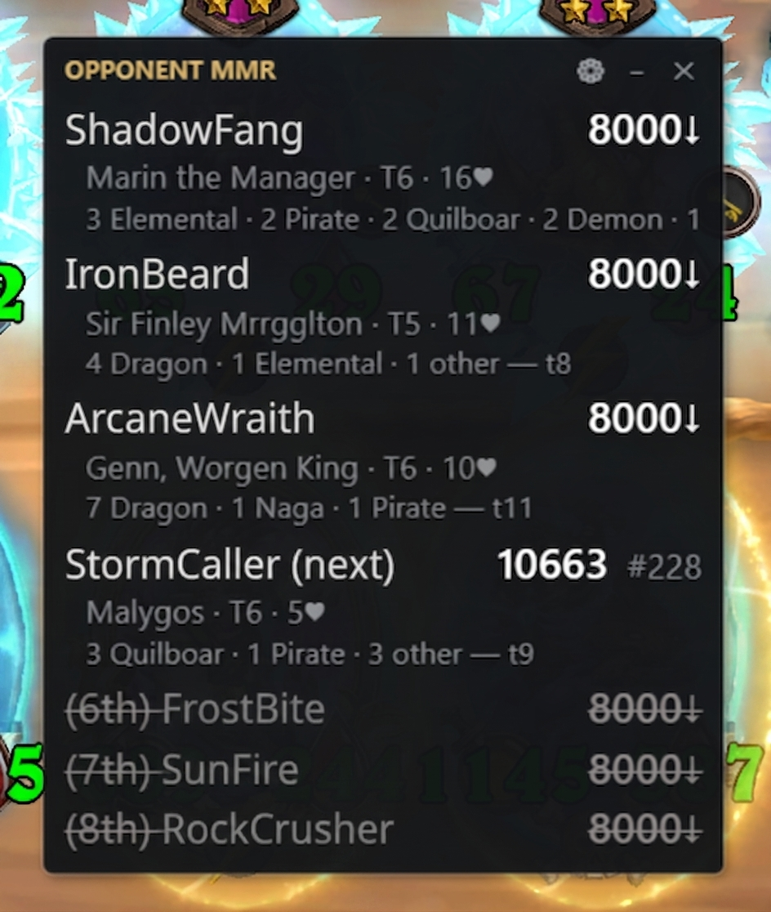
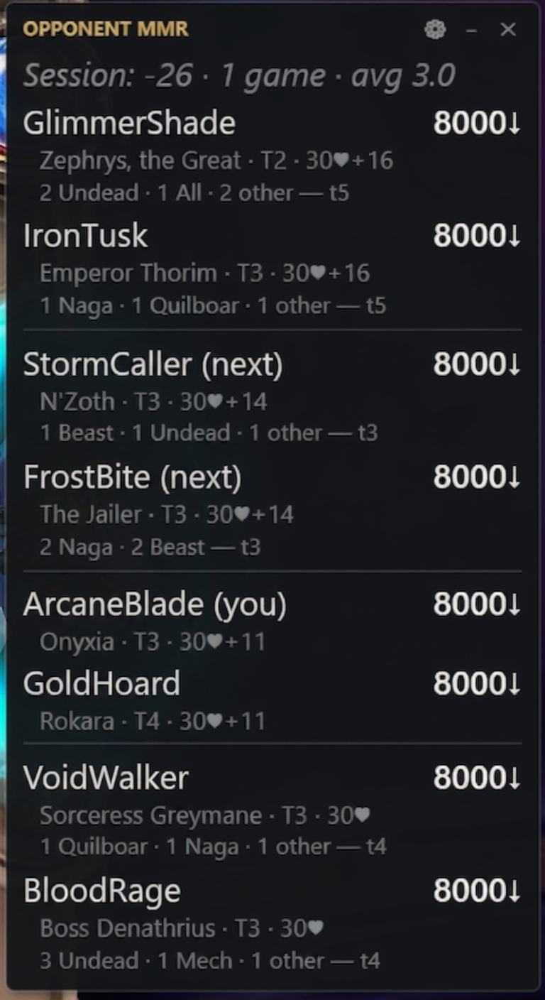
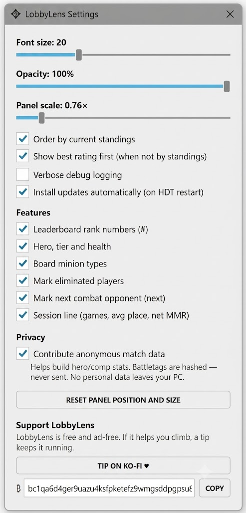

<p align="center"></p>

# LobbyLens

A Hearthstone Deck Tracker plugin that turns the Battlegrounds leaderboard rail into a live
tactical readout: every opponent's MMR and ladder rank, hero, tech tier, health, board
composition, live standings order, and eliminations — pinned in one HDT-styled panel.

No Overwolf, no ads, one DLL.

<table align="center"><tr>
<td align="center" valign="top"><br/><sub><b>Solo</b> lobby</sub></td>
<td align="center" valign="top"><br/><sub><b>Duos</b> lobby</sub></td>
</tr></table>

## Features

- **Opponent MMR + ladder rank** (`Prophane 11240 #389`) from the official Blizzard
  leaderboards (players below the 8000 cutoff show as `8000↓`)
- **Name resolution** — the panel appears from turn 1, reading the lobby roster from
  game memory; any name it can't get that way is filled when you hover the portrait,
  with a "hover N more portraits" countdown for the stragglers
- **Hero, tier, health** per player, live (`Jandice · T5 · 31♥+4`)
- **Board composition** of each opponent's last-fought board (`4 Mech · 2 Beast — t9`)
- **Live standings order** — rows reorder as rail places shift; rating sort available
- **Next opponent marker** — the player (or duos team) you fight next is tagged `(next)`,
  ghost boards included
- **Eliminations** — strikethrough + final place, hardened against false positives
- **Session tracker** — a running header line: games played, average finish, and net
  MMR for your current session (toggle in Settings)
- **Duos** — team grouping, shared-pool health, team placements
- Settings window: font size, opacity, panel scale, sort mode, per-feature toggles,
  privacy, verbose logging, position reset — opens in-game from the panel's ⚙ (or
  HDT's plugin-list button). Drag to move, scroll to zoom (0.5×–3×), drag the side
  edges to set width (double-click an edge for auto-width), drag the bottom-right
  corner to zoom.

<p align="center"><br/><sub>Settings</sub></p>

## Install

1. Download the latest `LobbyLens-vX.Y.Z.zip` from the [Releases page](https://github.com/xhodagx/LobbyLens/releases) and unzip it
2. Copy `LobbyLens.dll` into `%AppData%\HearthstoneDeckTracker\Plugins\` (paste that path into the File Explorer address bar)
3. Restart Hearthstone Deck Tracker and enable **LobbyLens** under Options → Tracker → Plugins
4. Join a Battlegrounds match — the panel appears from turn 1. Updates install themselves from then on.

## Updates

LobbyLens keeps itself up to date: it checks once per HDT session, **cryptographically
verifies** every release against a key baked into the plugin, and applies the update on
the next HDT restart. On by default; toggle it in Settings.

## Build

Requires the .NET SDK and an installed Hearthstone Deck Tracker (the newest
`%LocalAppData%\HearthstoneDeckTracker\app-*` folder is auto-detected for references;
override with `-p:HdtAppDir=<path>` if needed):

```
dotnet build LobbyLens/LobbyLens.csproj -c Release
```

Maintainer release process: [RELEASING.md](RELEASING.md).

## How it gets its data

- **Ratings** come from a small backend that mirrors Blizzard's **official leaderboards**
  into one cached file per region/mode; if it's ever unreachable, the plugin falls back
  to Blizzard's API directly, so ratings keep working regardless. Backend source:
  [lobbylens-functions](https://github.com/xhodagx/lobbylens-functions).
- **Everything else** (hero, tier, health, board comps, eliminations, standings) comes from
  HDT's game state and the game client's own UI memory — the same data the native rail
  hover uses. None of it leaves your PC.

## Privacy

LobbyLens can contribute **anonymized** match summaries to the backend to power future
community stats (hero/comp win rates, lobby difficulty). This is controlled by the
**Privacy → "Contribute anonymous match data"** setting.

- Battletags are **one-way SHA-256 hashed** before they ever leave your machine — raw
  player names are never transmitted or stored.
- A summary contains heroes, placements, tiers, ratings, and board comps for the lobby —
  no chat and no personal information. Every identifier in it (battletag, stable account
  id) is one-way hashed before it leaves your machine.
- Toggle it off any time in Settings.

Logs and settings live in `%AppData%\HearthstoneDeckTracker\LobbyLens\`.

## Support

LobbyLens is free, ad-free, and MIT-licensed. If it helps you climb, tips are welcome —
via Ko-fi, Bitcoin Lightning (best for small tips, near-zero fees), or on-chain Bitcoin
(better for larger tips). The current links and addresses are always in the plugin's
Settings window under **Support LobbyLens** — they're served remotely, so they stay
current even in older plugin versions.

## Related repositories

- [lobbylens-functions](https://github.com/xhodagx/lobbylens-functions) — the backend
  service (Azure Functions)

## License

MIT — Copyright (c) 2026 xhodagx
